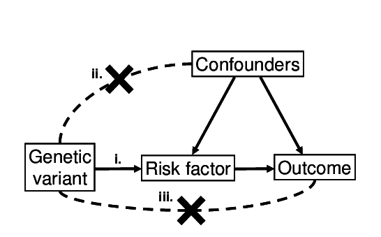

# Using logic programming to represent causal inference through Mendelian randomization

This project will explore the relationship between mendelian randomization and logic programming.

## Potential activities

**Task 1.** Write a probabilistic logic programme that simulates the biological structure underlying Mendelian randomization (MR)

- Parental transmission of alleles to offspring
- Manifestation of exposure phenotype in offspring
- Manifestation of outcome phenotype in offspring

**Task 2:** Generate data using this logic programme

- Mimics the type of data that we have to perform MR already
- Other types of data that could be more useful? For example, generating data for siblings or trios

**Task 3:** Can we learn the programme from the data?

- Can we learn the parameters given a model?
- Can we learn the structure of the model?
- How does it compare to inferential MR techniques?

**Task 4:** Can we add complications to the original programme in (Task 1) and then proceed to (2-3) with this more complex model?

- Potential joint transmission of environmental influences from Parents
- Potential secondary (pleiotropic) effects of the allele on the outcome

## Background on Mendelian randomisation

In epidemiology, one of the most common types of data is 'observational data' - where characteristics are measured in samples drawn from a population. If we wanted to estimate the causal effect of higher body mass index (BMI) on risk of coronary heart disease (CHD), these data could be used to do that - by regressing BMI against CHD. But there are potentially big problems because confounders could have biased our estimate.

https://en.wikipedia.org/wiki/Observational_study

Ideally we would instead perform a randomised controlled trial, where we randomly split a sample into two, give half the sample higher BMI and the other half is kept as a control. Measuring the difference in risk of CHD between these two halves is a more reliable indicator of the causal effect of BMI on CHD.

https://en.wikipedia.org/wiki/Randomized_controlled_trial

Observational data is very easily available, but unreliable. Randomised controlled trials are expensive and sometimes impossible, but have a reliable design. What instrumental variable analysis aims to achieve is finding a way to implement the principles of randomized controlled trials but using easily available observational data.

Some reflections on epidemiology (written 20 years ago but still relevant!): https://academic.oup.com/ije/article/30/1/1/619015

The original paper describing Mendelian randomisation: https://www.ncbi.nlm.nih.gov/pubmed/12689998

More recent paper describing Mendelian randomisation: https://www.ncbi.nlm.nih.gov/pubmed/25064373

The data used in Mendelian randomisation: https://elifesciences.org/articles/34408

A review article that Sam thought might be helpful: https://www.ncbi.nlm.nih.gov/pubmed/29876899

Simple explanation of the data generating model and how to perform MR: [mr_dgp.pdf](https://github.com/samwalrus/mr_logic/blob/master/mr_dgp.pdf)

### Problems - what can go wrong with MR

The rules of MR are outlined here:

Diagram of instrumental variable assumptions for Mendelian randomization. The three assumptions are illustrated - (i) the variant associates with the exposure; (ii) the variant does not associate with confounders; (iii) the variant is only associated with the outcome via the exposure

Of these assumptions, (i) can be proven just be observing if the association between variant and exposure exists. (ii) and (iii) are hard or impossible to prove. 

- Violation of (ii): Population and family structure - https://www.biorxiv.org/content/10.1101/602516v2 (note that this will be updated soon)
- Violation of (iii): Pleiotropy - https://www.ncbi.nlm.nih.gov/pubmed/12689998

## Background on Artifical Intelligence (AI)

In this project we are interested in using AI techniques to automatically
reason around a formalized version of Mendilian Randomisation. We will be interested in both
non-amplicative and ampliative reasoning. Non-amplicative reasoning is
deduction where the premise necessarily implies the conclusion, in contrast
ampliative reasoning introduces new knowledge. There are different
types of amplicative reasoning including Abductive reasoning, where we
reason backwards from a conclusion to hypothesise what needed to be
true to explain our observation and inductive reasoning where we
generalize observations to write write new rules which can be used in
future predictions. Further due to noisiness of epidemiological data
we will also be interested in reasoning under uncertainty. For this
reason probabilistic and fuzzy logics will likely be needed.

A number of tools and techniques have been developed to aid logical
reasoning and inference. These include automated reasoning using logic
programming in Prolog and more recently Answer Set Programming
(ASP). Many different algorithms and software have been developed that
use either Prolog or ASP to perform abduction and induction. In
addition many different techniques have been developed for reasoning
under uncertainty including probablisitic and fuzzy versions of Prolog.

Introductory Reading:

- Logic Programming in Prolog - https://book.simply-logical.space/ 
- ASP https://www.cs.utexas.edu/users/vl/papers/wiasp.pdf 
- Abductive Logic Programming: https://book.simply-logical.space/ Chapters 8
- Inductive Logic Programming: https://book.simply-logical.space/
  Chapters 9
- Probabilistic Logic Programming - https://edu.swi-prolog.org/course/view.php?id=4A

See an example of logic programming for Mendelian inheritance here: http://cplint.eu/e/mendel.pl

...
